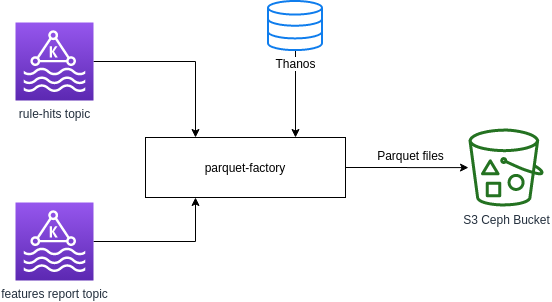

# Architecture

This program is intended to be run as a
[Cronjob](https://docs.openshift.com/container-platform/4.6/nodes/jobs/nodes-nodes-jobs.html)
that will aggregate data received from 3 data sources:

- A Kafka topic with Insights rules results generated for the archives received
  from customers.
- A second Kafka topic with the result of the features extraction over the same
  archives as the one above.

The **Parquet Factory** is using a kappa architecture. This means that it takes
the messages queue (Kafka in this case) as a "source of truth". Opposite to a
lambda approach, that will be running always, reading messages from the queue,
in a kappa architecture a set of messages is read from the queue and then
processed. When the processing finishes, the messages are removed from the queue
to avoid processing the same message twice.

In our specific case, the message queues are several Kafka topics, which holds
data until the Parquet Factory reads and processes it.

Kafka doesn't support removing messages, but it the consumer groups offset
feature is used instead to "mark" the already consumed messages. It brings up
the possibility of "replay" the processing of the archives, which will be useful
if some problem happens or if we want to perform a different processing over the
data stored in the Kafka topics.

## Insights rules results

The Insights rules results are read from a Kafka topic that can be configured.
These results are generated by the Rules service in the internal data
pipeline.

These messages are used to extract information about which OCP rules are hit by
every cluster reporting to Red Hat.

## Feature extraction results

These results are read from a Kafka topic produced by the Feature
Service.

These messages includes the results of feature extraction for every archive
uploaded by the clusters.
